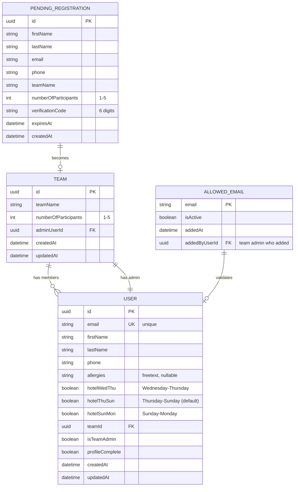
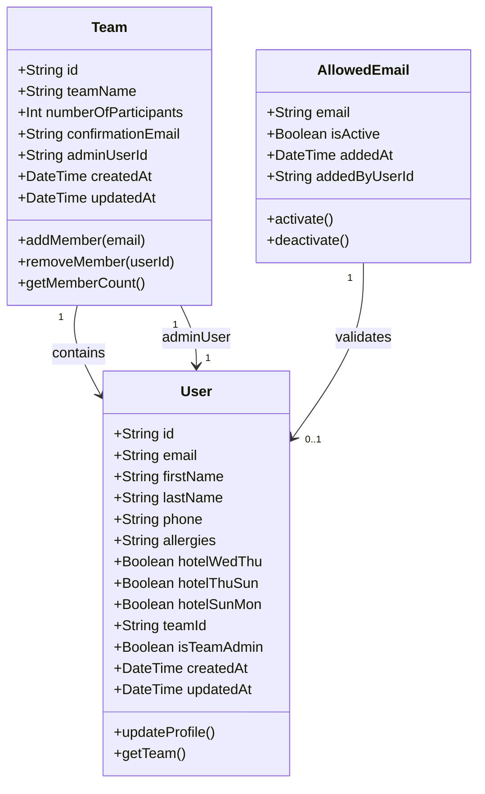
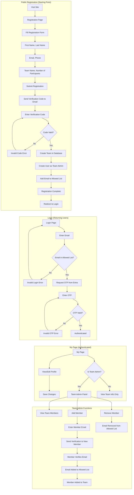
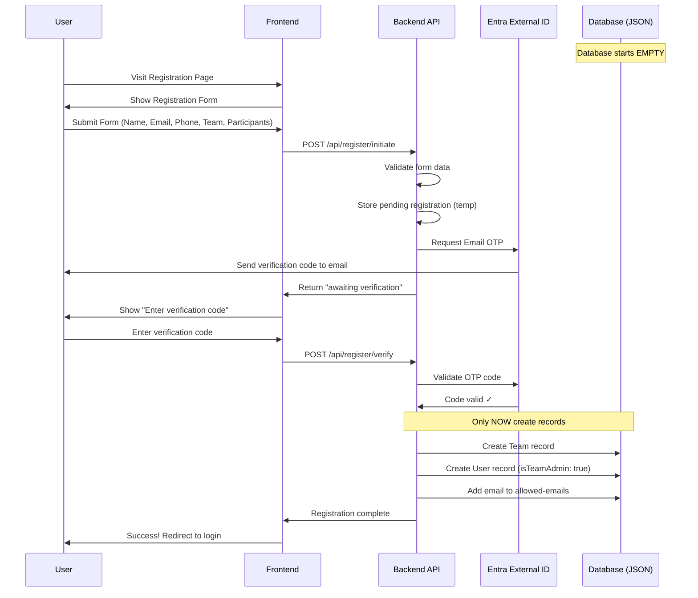
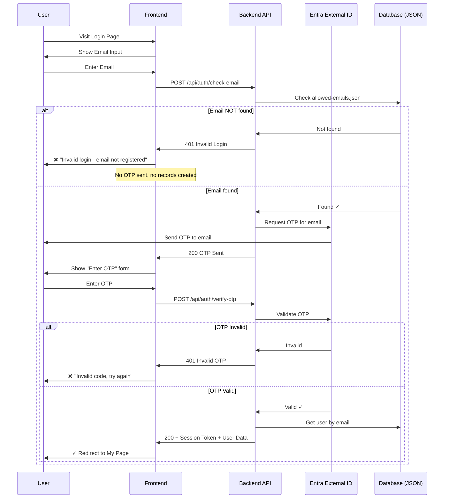

# ACDC Portal - Project Definition

## Overview

A cost-effective Azure-hosted portal for team registration and member management with Entra External ID authentication using Email One-Time Password (OTP).

---

## Tech Stack (Cheapest Azure Options)

| Layer | Technology | Local Dev | Production | Cost |
|-------|------------|-----------|------------|------|
| **Hosting** | Azure Static Web Apps | Local dev server | Free Tier | $0/month |
| **Frontend** | Vanilla JavaScript + HTML5 + CSS3 | Same | Same | $0 |
| **Backend API** | Azure Functions (Node.js v4 Model) | Local Functions runtime | Included in SWA | $0 |
| **Authentication** | Microsoft Entra External ID | Mock/Real | Email OTP | Free < 50K MAU |
| **Database** | JSON File Storage | Local `/data` folder | Azure Blob Storage | $0-1/month |

### Why This Stack?

1. **Azure Static Web Apps Free Tier** - Includes SSL, global CDN, custom domains, integrated Azure Functions, and GitHub Actions CI/CD
2. **Vanilla JS** - No framework overhead, fastest load times, no build step required
3. **Azure Functions v4 Model** - Latest programming model with `@azure/functions` package, cleaner code, better TypeScript support
4. **Entra External ID** - First 50,000 monthly active users are free with email OTP
5. **JSON File Storage** - Simple, portable, easy migration to any database later
6. **GitHub Actions** - Automatic deployment on push (configured by Azure)

---

## Development & Deployment Flow

```
┌─────────────────────────────────────────────────────────────────────────┐
│                         DEVELOPMENT WORKFLOW                            │
├─────────────────────────────────────────────────────────────────────────┤
│                                                                         │
│  LOCAL DEVELOPMENT                                                      │
│  ─────────────────                                                      │
│  ┌─────────────┐    ┌─────────────┐    ┌─────────────────────────┐     │
│  │   VS Code   │───▶│  SWA CLI    │───▶│  http://localhost:4280  │     │
│  │   (Edit)    │    │  (Emulator) │    │  (Test locally)         │     │
│  └─────────────┘    └─────────────┘    └─────────────────────────┘     │
│                            │                                            │
│                            ▼                                            │
│                     ┌─────────────┐                                     │
│                     │ /data/*.json│  ← Persists across restarts        │
│                     │ (Local DB)  │                                     │
│                     └─────────────┘                                     │
│                                                                         │
│  DEPLOYMENT                                                             │
│  ──────────                                                             │
│  ┌─────────────┐    ┌─────────────┐    ┌─────────────────────────┐     │
│  │  git push   │───▶│   GitHub    │───▶│  GitHub Actions         │     │
│  │  (to main)  │    │   Repo      │    │  (Auto-triggered)       │     │
│  └─────────────┘    └─────────────┘    └───────────┬─────────────┘     │
│                                                     │                   │
│                                                     ▼                   │
│                                        ┌─────────────────────────┐     │
│                                        │  Azure Static Web Apps  │     │
│                                        │  (Production)           │     │
│                                        └─────────────────────────┘     │
│                                                                         │
└─────────────────────────────────────────────────────────────────────────┘
```

---

## Architecture

```
┌─────────────────────────────────────────────────────────────────────────┐
│                        Azure Static Web Apps                            │
│  ┌────────────────────────────────────────────────────────────────────┐│
│  │                      Frontend (Vanilla JS)                         ││
│  │  ┌──────────────┐  ┌──────────────┐  ┌────────────────────────┐   ││
│  │  │    Login     │  │   My Page    │  │   Team Registration    │   ││
│  │  │    (OTP)     │  │  (Profile)   │  │       (Public)         │   ││
│  │  └──────┬───────┘  └──────┬───────┘  └───────────┬────────────┘   ││
│  └─────────┼─────────────────┼──────────────────────┼────────────────┘│
│            │                 │                      │                  │
│            └─────────────────┼──────────────────────┘                  │
│                              ▼                                         │
│  ┌────────────────────────────────────────────────────────────────────┐│
│  │                    Azure Functions (API)                           ││
│  │  ┌────────────┐  ┌────────────┐  ┌────────────┐  ┌─────────────┐  ││
│  │  │ /api/auth  │  │ /api/users │  │ /api/teams │  │ /api/members│  ││
│  │  └──────┬─────┘  └──────┬─────┘  └──────┬─────┘  └──────┬──────┘  ││
│  └─────────┼───────────────┼───────────────┼───────────────┼─────────┘│
│            └───────────────┼───────────────┼───────────────┘          │
│                            ▼               ▼                           │
│  ┌────────────────────────────────────────────────────────────────────┐│
│  │                    Data Storage Layer                              ││
│  │  ┌─────────────────────────────────────────────────────────────┐  ││
│  │  │  LOCAL: /data/*.json     │  PROD: Azure Blob/Cosmos DB      │  ││
│  │  │  ├── users.json          │  (Same JSON structure)           │  ││
│  │  │  ├── teams.json          │                                  │  ││
│  │  │  └── allowed-emails.json │                                  │  ││
│  │  └─────────────────────────────────────────────────────────────┘  ││
│  └────────────────────────────────────────────────────────────────────┘│
└─────────────────────────────────────────────────────────────────────────┘
                              │
                              ▼
              ┌───────────────────────────────────┐
              │   Microsoft Entra External ID     │
              │        (Email OTP Auth)           │
              └───────────────────────────────────┘
```

---

## Data Model

### Entity Relationship Diagram (Mermaid)



### Class Diagram (Mermaid)



### User Flow Diagram (Mermaid)



### Registration Sequence Diagram (Mermaid)



### JSON Schema Definitions

#### Team
```json
{
  "id": "uuid",
  "teamName": "string",
  "numberOfParticipants": "number (1-5)",
  "adminUserId": "uuid (FK to User)",
  "createdAt": "datetime",
  "updatedAt": "datetime"
}
```

#### User (Team Member)
```json
{
  "id": "uuid",
  "email": "string (unique, primary identifier)",
  "firstName": "string",
  "lastName": "string",
  "phone": "string",
  "allergies": "string (freetext, nullable - filled later)",
  "hotelWedThu": "boolean (Wednesday-Thursday, default: false)",
  "hotelThuSun": "boolean (Thursday-Sunday, default: true)",
  "hotelSunMon": "boolean (Sunday-Monday, default: false)",
  "teamId": "uuid (FK to Team)",
  "isTeamAdmin": "boolean",
  "profileComplete": "boolean (false until allergies/hotel filled)",
  "createdAt": "datetime",
  "updatedAt": "datetime"
}
```

#### Allowed Emails (Validation Store)
```json
{
  "email": "string (unique)",
  "isActive": "boolean",
  "addedAt": "datetime",
  "addedByUserId": "uuid (FK to User, nullable for initial admin)"
}
```

#### Pending Registration (Temporary - before verification)
```json
{
  "id": "uuid",
  "firstName": "string",
  "lastName": "string",
  "email": "string",
  "phone": "string",
  "teamName": "string",
  "numberOfParticipants": "number (1-5)",
  "verificationCode": "string (6 digits)",
  "expiresAt": "datetime (15 minutes from creation)",
  "createdAt": "datetime"
}
```

### Relationships
- **Team → Users**: One-to-Many (1 Team has 1-5 Users)
- **User → Team**: Many-to-One (1 User belongs to 1 Team)
- **Team Admin**: User with `isTeamAdmin: true` can manage team members
- **Allowed Email → User**: One-to-One (validates login access)

### Initial Database State
```json
// data/teams.json
[]

// data/users.json
[]

// data/allowed-emails.json
[]

// data/pending-registrations.json
[]
```

---

## Features & User Flows

### Two Entry Points with Different OTP Logic

```
┌─────────────────────────────────────────────────────────────────────────┐
│                        TWO DIFFERENT PAGES                              │
├──────────────────────────────────┬──────────────────────────────────────┤
│      TEAM REGISTRATION           │           TEAM LOGIN                 │
│      (/register.html)            │           (/login.html)              │
├──────────────────────────────────┼──────────────────────────────────────┤
│                                  │                                      │
│  Purpose: CREATE new team        │  Purpose: ACCESS existing account    │
│                                  │                                      │
│  Who: Anyone (public)            │  Who: Existing users only            │
│                                  │                                      │
│  Collects:                       │  Collects:                           │
│  • First Name, Last Name         │  • Email only                        │
│  • Email, Phone                  │                                      │
│  • Team Name, # Participants     │                                      │
│                                  │                                      │
│  OTP Purpose:                    │  OTP Purpose:                        │
│  → Verify email is real          │  → Authenticate existing user        │
│  → THEN create records           │  → Does NOT create any records       │
│                                  │                                      │
│  After OTP:                      │  After OTP:                          │
│  ✓ Team created                  │  ✓ Session created                   │
│  ✓ User created (admin)          │  ✓ Redirect to My Page               │
│  ✓ Email added to allowed list   │                                      │
│  ✓ Redirect to Login             │  If email NOT in database:           │
│                                  │  ✗ "Invalid login" error             │
│                                  │  ✗ No OTP sent                       │
│                                  │  ✗ No records created                │
│                                  │                                      │
└──────────────────────────────────┴──────────────────────────────────────┘
```

### 1. Team Registration Page (/register.html)

**Purpose: Create new teams and their admin user**

```
┌─────────────────────────────────────────────────────────────────────────┐
│                    TEAM REGISTRATION FORM                               │
│                    (Public - Anyone can access)                         │
├─────────────────────────────────────────────────────────────────────────┤
│                                                                         │
│   Personal Information                                                  │
│   ┌─────────────────────────────────────────────────────────────────┐  │
│   │  First Name:    [____________________]                          │  │
│   │  Last Name:     [____________________]                          │  │
│   │  Email:         [____________________]                          │  │
│   │  Phone:         [____________________]                          │  │
│   └─────────────────────────────────────────────────────────────────┘  │
│                                                                         │
│   Team Information                                                      │
│   ┌─────────────────────────────────────────────────────────────────┐  │
│   │  Team Name:              [____________________]                 │  │
│   │  Number of Participants: [1-5 dropdown_______]                  │  │
│   └─────────────────────────────────────────────────────────────────┘  │
│                                                                         │
│                    [ Register Team ]                                    │
│                                                                         │
│   Already have an account? [Login here]                                │
│                                                                         │
└─────────────────────────────────────────────────────────────────────────┘
                                    │
                                    ▼
┌─────────────────────────────────────────────────────────────────────────┐
│                    VERIFICATION STEP                                    │
├─────────────────────────────────────────────────────────────────────────┤
│                                                                         │
│   📧 A verification code has been sent to your email                   │
│                                                                         │
│   ┌─────────────────────────────────────────────────────────────────┐  │
│   │  Verification Code:  [______]                                   │  │
│   └─────────────────────────────────────────────────────────────────┘  │
│                                                                         │
│                    [ Verify & Complete Registration ]                   │
│                                                                         │
│   Didn't receive code? [Resend]                                        │
│                                                                         │
└─────────────────────────────────────────────────────────────────────────┘
                                    │
                                    ▼ (Only after OTP verified)
                    ┌───────────────────────────────────┐
                    │  ✓ Team Created in database       │
                    │  ✓ User Created (isTeamAdmin)     │
                    │  ✓ Email Added to Allowed List    │
                    │                                   │
                    │  "Registration successful!"       │
                    │  → Redirect to Login page         │
                    └───────────────────────────────────┘
```

### 2. Team Login Page (/login.html)

**Purpose: Authenticate EXISTING users only - never creates records**

```
┌─────────────────────────────────────────────────────────────────────────┐
│                    TEAM LOGIN                                           │
│                    (Existing users only)                                │
├─────────────────────────────────────────────────────────────────────────┤
│                                                                         │
│   ┌─────────────────────────────────────────────────────────────────┐  │
│   │  Email:  [____________________]                                 │  │
│   └─────────────────────────────────────────────────────────────────┘  │
│                                                                         │
│                    [ Continue ]                                         │
│                                                                         │
│   Don't have an account? [Register your team]                          │
│                                                                         │
└─────────────────────────────────────────────────────────────────────────┘
                                    │
                                    ▼
                    ┌───────────────────────────────────┐
                    │  Check: Is email in database?     │
                    │  (allowed-emails.json)            │
                    └───────────────┬───────────────────┘
                                    │
                    ┌───────────────┴───────────────┐
                    ▼                               ▼
            ┌───────────────┐               ┌───────────────┐
            │  EMAIL FOUND  │               │ NOT FOUND     │
            └───────┬───────┘               └───────┬───────┘
                    │                               │
                    ▼                               ▼
            ┌───────────────┐               ┌───────────────────────┐
            │ Send OTP via  │               │ ❌ "Invalid login"    │
            │ Entra Email   │               │                       │
            └───────┬───────┘               │ No OTP sent.          │
                    │                       │ No records created.   │
                    ▼                       │                       │
            ┌───────────────┐               │ [Register instead?]   │
            │ Enter OTP     │               └───────────────────────┘
            └───────┬───────┘
                    │
                    ▼
            ┌───────────────┐
            │ OTP Valid?    │
            └───────┬───────┘
                    │
            ┌───────┴───────┐
            ▼               ▼
        [Valid]         [Invalid]
            │               │
            ▼               ▼
    ┌───────────────┐  ┌───────────────┐
    │ ✓ Login OK    │  │ ❌ Try again  │
    │ → My Page     │  └───────────────┘
    └───────────────┘
```

### Login Sequence Diagram (Mermaid)



### 3. My Page - Profile Management
```
[My Page] (Authenticated)
    │
    ├── View/Edit Profile
    │   ├── First Name
    │   ├── Last Name
    │   ├── Phone
    │   ├── Email (read-only)
    │   ├── Allergies (freetext)
    │   └── Hotel Nights Selection
    │       ├── [ ] Wednesday - Thursday
    │       ├── [x] Thursday - Sunday (default)
    │       └── [ ] Sunday - Monday
    │
    └── If Team Admin:
        └── Manage Team Members
            ├── View all team members
            ├── Add new member (triggers verification email)
            └── Remove member
```

### 4. Team Admin - Add Member Flow
```
[Team Admin] → Add Member → Enter Email
                               │
                               ▼
                    [Send Verification Email]
                               │
                               ▼
                    [New Member Receives Code]
                               │
                               ▼
                    [Member Clicks Verification Link or Enters Code]
                               │
                               ▼
            ┌──────────────────────────────────────┐
            │  ✓ Email Added to Allowed List       │
            │  ✓ User Created (empty profile)      │
            │  ✓ User Linked to Team               │
            │                                      │
            │  Member can now login to complete    │
            │  their profile                       │
            └──────────────────────────────────────┘
```

---

## Page Structure

```
/
├── src/
│   ├── index.html              → Landing page (links to Register/Login)
│   ├── register.html           → Team Registration (creates new team + admin)
│   ├── login.html              → Team Login (existing users only)
│   ├── my-page.html            → Protected profile page
│   ├── team-admin.html         → Protected team management (admin only)
│   │
│   ├── css/
│   │   └── styles.css          → All styles
│   │
│   └── js/
│       ├── auth.js             → Entra External ID integration
│       ├── api.js              → API client for backend calls
│       ├── register.js         → Registration page logic
│       ├── login.js            → Login page logic
│       ├── my-page.js          → Profile management
│       └── team-admin.js       → Team admin logic
│
├── api/                        → Azure Functions (Backend API)
│   ├── register-initiate/
│   │   └── index.js            → Start registration, send verification
│   ├── register-verify/
│   │   └── index.js            → Verify code, create team & user
│   ├── auth-check-email/
│   │   └── index.js            → Check if email exists in database
│   ├── auth-send-otp/
│   │   └── index.js            → Send OTP via Entra (login only)
│   ├── auth-verify-otp/
│   │   └── index.js            → Verify OTP, return session
│   ├── users/
│   │   └── index.js            → User CRUD operations
│   ├── teams/
│   │   └── index.js            → Team CRUD operations
│   ├── members/
│   │   └── index.js            → Team member management
│   └── shared/
│       ├── storage.js          → JSON file storage abstraction
│       └── email.js            → Email sending (verification codes)
│
├── data/                       → LOCAL JSON Database (starts EMPTY)
│   ├── users.json              → []
│   ├── teams.json              → []
│   ├── allowed-emails.json     → []
│   └── pending-registrations.json → [] (temp, cleaned up after verification)
│
├── .github/
│   └── workflows/
│       └── azure-static-web-apps.yml  → Auto-generated by Azure
│
├── staticwebapp.config.json    → SWA routing & auth config
├── package.json
├── local.settings.json         → Local dev settings (gitignored)
└── PROJECT_DEFINITION.md       → This file
```

---

## Entra External ID Configuration

### Required Setup in Azure Portal

1. **Create Entra External ID Tenant**
   - Go to Azure Portal → Microsoft Entra External ID
   - Create new external tenant

2. **Configure Email OTP**
   - Authentication methods → Email one-time passcode → Enable
   - No password required

3. **Register Application**
   - App registrations → New registration
   - Redirect URI: `https://your-app.azurestaticapps.net`
   - Enable ID tokens

4. **User Flow**
   - Create Sign-up/Sign-in user flow
   - Select Email OTP as authentication method

### MSAL Configuration
```javascript
const msalConfig = {
  auth: {
    clientId: "YOUR_CLIENT_ID",
    authority: "https://YOUR_TENANT.ciamlogin.com/",
    redirectUri: "https://your-app.azurestaticapps.net"
  }
};
```

---

## Local Development Setup

### Prerequisites
```bash
# Required installations
node -v          # Node.js 20.x LTS required (Azure Functions v4 compatible)
npm -v           # npm 9+ required
func --version   # Azure Functions Core Tools 4.x
swa --version    # Azure Static Web Apps CLI
nvm version      # NVM for Windows (Node Version Manager)
```

### Install Tools (One-time)
```powershell
# Install NVM for Windows (industry-standard Node.js version manager)
winget install CoreyButler.NVMforWindows

# RESTART VS Code/Terminal after NVM install, then:
nvm install 20       # Install Node.js 20 LTS
nvm use 20           # Switch to Node.js 20

# Install Azure Functions Core Tools
npm install -g azure-functions-core-tools@4 --unsafe-perm true

# Install Azure Static Web Apps CLI
npm install -g @azure/static-web-apps-cli

# Install Azure CLI (for deployment)
winget install Microsoft.AzureCLI
```

### Why Node.js 20 LTS?
- Azure Functions v4 officially supports Node.js 18.x and 20.x LTS
- Node.js 20 LTS is the current recommended version for Azure
- The `.nvmrc` file in the project root specifies the required version
- Any developer can run `nvm use` to switch to the correct version

### Initialize Project
```powershell
# Clone from GitHub (after initial push)
git clone https://github.com/YOUR_ORG/ACDCPortal.git
cd ACDCPortal

# Install dependencies
npm install

# Create local data folder with EMPTY arrays (ignored by git, persists locally)
mkdir data
echo '[]' | Out-File -Encoding utf8 data/users.json
echo '[]' | Out-File -Encoding utf8 data/teams.json
echo '[]' | Out-File -Encoding utf8 data/allowed-emails.json
echo '[]' | Out-File -Encoding utf8 data/pending-registrations.json
```

### Run Locally
```powershell
# Start the full local environment (frontend + API + auth emulator)
swa start src --api-location api

# This starts:
# - Frontend: http://localhost:4280
# - API: http://localhost:7071/api/*
# - Data persists in /data/*.json folder
```

### Local Data Persistence
The `/data` folder contains JSON files that:
- ✅ Persist across computer restarts
- ✅ Can be manually edited for testing
- ✅ Same structure as production database
- ⚠️ Gitignored (not committed to repo)
- ⚠️ Local only (each developer has own data)

---

## GitHub Repository Setup

### Initial Setup
```powershell
# Initialize git (if not already)
git init

# Add all files
git add .

# Create initial commit
git commit -m "Initial project setup"

# Add GitHub remote
git remote add origin https://github.com/YOUR_ORG/ACDCPortal.git

# Push to GitHub
git push -u origin main
```

### Recommended .gitignore
```
# Dependencies
node_modules/

# Local data (persists locally, not in repo)
data/

# Local settings
local.settings.json
.env

# Build outputs
dist/

# IDE
.vscode/
*.swp

# OS files
.DS_Store
Thumbs.db
```

---

## Azure Deployment Setup

### Step 1: Create Azure Static Web App

```powershell
# Login to Azure
az login

# Create resource group (if needed)
az group create --name rg-acdc-portal --location westeurope

# Create Static Web App linked to GitHub
az staticwebapp create \
  --name acdc-portal \
  --resource-group rg-acdc-portal \
  --source https://github.com/YOUR_ORG/ACDCPortal \
  --location westeurope \
  --branch main \
  --app-location "/src" \
  --api-location "/api" \
  --output-location "" \
  --login-with-github
```

### Step 2: GitHub Actions (Auto-Generated)

Azure automatically creates `.github/workflows/azure-static-web-apps.yml`:

```yaml
name: Azure Static Web Apps CI/CD

on:
  push:
    branches:
      - main
  pull_request:
    types: [opened, synchronize, reopened, closed]
    branches:
      - main

jobs:
  build_and_deploy_job:
    runs-on: ubuntu-latest
    name: Build and Deploy Job
    steps:
      - uses: actions/checkout@v3
      
      - name: Build And Deploy
        uses: Azure/static-web-apps-deploy@v1
        with:
          azure_static_web_apps_api_token: ${{ secrets.AZURE_STATIC_WEB_APPS_API_TOKEN }}
          repo_token: ${{ secrets.GITHUB_TOKEN }}
          action: "upload"
          app_location: "/src"
          api_location: "/api"
          output_location: ""
```

### Step 3: Deployment Flow

```
┌──────────────────────────────────────────────────────────────────────┐
│                        DEPLOYMENT PIPELINE                           │
├──────────────────────────────────────────────────────────────────────┤
│                                                                      │
│   Developer        GitHub              GitHub Actions      Azure     │
│   ─────────        ──────              ──────────────      ─────     │
│                                                                      │
│   git push ────────▶ main branch                                     │
│                         │                                            │
│                         │ (webhook trigger)                          │
│                         ▼                                            │
│                     ┌───────────────────┐                            │
│                     │  GitHub Actions   │                            │
│                     │  Workflow Runs    │                            │
│                     └─────────┬─────────┘                            │
│                               │                                      │
│                               │ (build & deploy)                     │
│                               ▼                                      │
│                     ┌───────────────────────────────┐                │
│                     │  Azure Static Web Apps        │                │
│                     │  https://acdc-portal.azure... │                │
│                     └───────────────────────────────┘                │
│                                                                      │
│   Time: ~2-3 minutes from push to live                               │
│                                                                      │
└──────────────────────────────────────────────────────────────────────┘
```

---

## Validation Rules

| Field | Validation |
|-------|------------|
| Email | Valid email format, unique |
| First Name | Required, 2-50 characters |
| Last Name | Required, 2-50 characters |
| Phone | Required for registration, valid phone format |
| Allergies | Optional, max 500 characters |
| Hotel Nights | At least one option selected (on profile save) |
| Team Name | Required, 2-100 characters, unique |
| Participants | Required, 1-5 |
| Team Members | Cannot exceed numberOfParticipants |
| Verification Code | 6 digits, expires after 15 minutes |

---

## Security Considerations

1. **Authentication**
   - All protected pages check for valid Entra session
   - Email must exist in allowed_emails list
   - OTP provides passwordless security

2. **Authorization**
   - Team admin functions only visible to `isTeamAdmin: true`
   - Users can only edit their own profile
   - Team admins can only manage their team

3. **LocalStorage Limitations**
   - Data is browser-specific (not synced)
   - Can be cleared by user
   - For MVP/development only

---

## Migration Path to Production Storage

When ready to move from local JSON files to real database:

### Option 1: Azure Blob Storage (Cheapest)
- Cost: ~$0.02/GB/month
- Same JSON structure, just stored in Azure
- Simple SDK change in `api/shared/storage.js`

### Option 2: Azure Cosmos DB (Free Tier)
- 1000 RU/s, 25GB storage free
- JSON document database (same structure)
- Better for concurrent access

### Option 3: Azure SQL (Serverless)
- Auto-pause when not in use
- ~$5/month for low traffic
- Requires schema migration

### Migration Steps
1. Create Azure storage resource
2. Update `api/shared/storage.js` with new connection
3. Run data migration script
4. Deploy and test

---

## Estimated Costs

| Service | Monthly Cost |
|---------|-------------|
| Azure Static Web Apps (Free) | $0 |
| Azure Functions (included) | $0 |
| Entra External ID (<50K MAU) | $0 |
| Local JSON storage | $0 |
| GitHub (public/private repo) | $0 |
| **Total (Development)** | **$0** |
| **Total (Production + Blob)** | **~$1** |

---

## Development Phases

### Phase 1: Foundation ⬜
- [ ] Initialize npm project
- [ ] Create folder structure
- [ ] Set up Azure Functions project
- [ ] Create JSON storage service
- [ ] Initialize empty local data files
- [ ] Basic HTML pages with CSS

### Phase 2: Registration Flow ⬜
- [ ] Create registration form UI
- [ ] POST `/api/register/initiate` - validate & store pending
- [ ] Generate 6-digit verification code
- [ ] Send verification email (use SendGrid or similar)
- [ ] POST `/api/register/verify` - validate code
- [ ] Create Team record
- [ ] Create User record (as team admin)
- [ ] Add email to allowed list
- [ ] Redirect to login

### Phase 3: Authentication ⬜
- [ ] Set up Entra External ID tenant
- [ ] Configure Email OTP for login
- [ ] Register application in Azure
- [ ] Implement MSAL.js in frontend
- [ ] Create login flow (check allowed list first)
- [ ] Implement logout

### Phase 4: My Page (Profile) ⬜
- [ ] Protected route check
- [ ] Fetch user profile from API
- [ ] Profile edit form (allergies, hotel nights)
- [ ] Save to API/storage
- [ ] Mark `profileComplete: true`
- [ ] Show team info (read-only)

### Phase 5: Team Admin ⬜
- [ ] Admin-only view (check `isTeamAdmin`)
- [ ] Member list display
- [ ] Add member: enter email → send verification
- [ ] Member verification flow
- [ ] Remove member functionality
- [ ] Participant limit enforcement (1-5)

### Phase 6: Polish & Deploy ⬜
- [ ] Form validation (all fields)
- [ ] Error handling & user-friendly messages
- [ ] Loading states / spinners
- [ ] Responsive design
- [ ] GitHub repository setup
- [ ] Azure Static Web Apps creation
- [ ] Connect GitHub → Azure (auto CI/CD)
- [ ] Entra configuration for production
- [ ] First production deployment

---

## Deployment

### Local Development
```powershell
# Start everything locally
swa start src --api-location api

# Access at http://localhost:4280
```

### Deploy to Production
```powershell
# Simply push to GitHub - GitHub Actions handles the rest
git add .
git commit -m "Your changes"
git push origin main

# Deployment is automatic via GitHub Actions
# Check status: https://github.com/YOUR_ORG/ACDCPortal/actions
```

### Manual Deployment (Alternative)
```powershell
# If needed, deploy directly from CLI
swa deploy ./src --api-location ./api --env production
```

---

## Estimated Costs

| Service | Monthly Cost |
|---------|-------------|
| Azure Static Web Apps (Free) | $0 |
| Entra External ID (<50K MAU) | $0 |
| LocalStorage | $0 |
| Custom Domain (optional) | $0-12/year |
| **Total** | **$0-1/month** |

---

## 🚀 Deployment TODO

When deploying to Azure Static Web Apps, configure these environment variables in the Azure Portal:

### Required Environment Variables

| Variable | Description | Example |
|----------|-------------|---------|
| `AZURE_CLIENT_ID` | Entra External ID app client ID | `c14c3e9e-a80f-4c83-ab48-52673788cf8f` |
| `AZURE_CLIENT_SECRET` | Entra External ID app secret | `KkY8Q~...` |
| `AZURE_TENANT_ID` | Entra External ID tenant ID | `6faefb57-2c64-4298-a1c2-28d08a434986` |
| `ENTRA_ISSUER_DOMAIN` | External ID domain | `acdcregistration.onmicrosoft.com` |
| `MAIL_CLIENT_ID` | M365 mail app client ID | `92a23e6d-8b30-4013-ac52-87b2c000b518` |
| `MAIL_CLIENT_SECRET` | M365 mail app secret | `z5k8Q~...` |
| `MAIL_TENANT_ID` | M365 tenant ID (with Exchange) | `333db3f9-14bc-438d-982f-3736b7c8563e` |
| `MAIL_SENDER` | Email sender address | `no-reply@acdc.blog` |
| `PORTAL_URL` | Production URL | `https://yourapp.azurestaticapps.net` |
| `RECAPTCHA_SECRET_KEY` | reCAPTCHA secret (if using) | `6Lc...` |

### How to Add Environment Variables

```powershell
# Via Azure CLI
az staticwebapp appsettings set --name acdc-portal --resource-group rg-acdc-portal --setting-names \
  AZURE_CLIENT_ID="c14c3e9e-a80f-4c83-ab48-52673788cf8f" \
  MAIL_CLIENT_ID="92a23e6d-8b30-4013-ac52-87b2c000b518" \
  # ... etc

# Or via Azure Portal:
# Static Web Apps → Configuration → Application settings → + Add
```

### Also Update Frontend Config

Update `src/js/config.js` with production values:
- `auth.clientId` - Same as `AZURE_CLIENT_ID`
- `auth.authority` - Production Entra External ID authority
- `auth.redirectUri` - Production URL
- `api.baseUrl` - `/api` (relative for SWA)

---

## Next Steps

1. ✅ Project definition complete
2. ⬜ Initialize npm project and folder structure
3. ⬜ Create Azure Functions API with JSON storage
4. ⬜ Build frontend pages
5. ⬜ Set up Entra External ID tenant
6. ⬜ Configure Email OTP authentication
7. ⬜ Create GitHub repository
8. ⬜ Link to Azure Static Web Apps
9. ⬜ Test locally with `swa start`
10. ⬜ Push to GitHub → Auto-deploy to Azure

---

## Quick Reference Commands

```powershell
# Start local development
swa start src --api-location api

# Run only the API
cd api && func start

# Deploy to Azure (via Git)
git push origin main

# Check Azure deployment status
az staticwebapp show --name acdc-portal --resource-group rg-acdc-portal
```

---

*Document created: January 24, 2026*
*Version: 2.0*
*Last updated: January 24, 2026*
